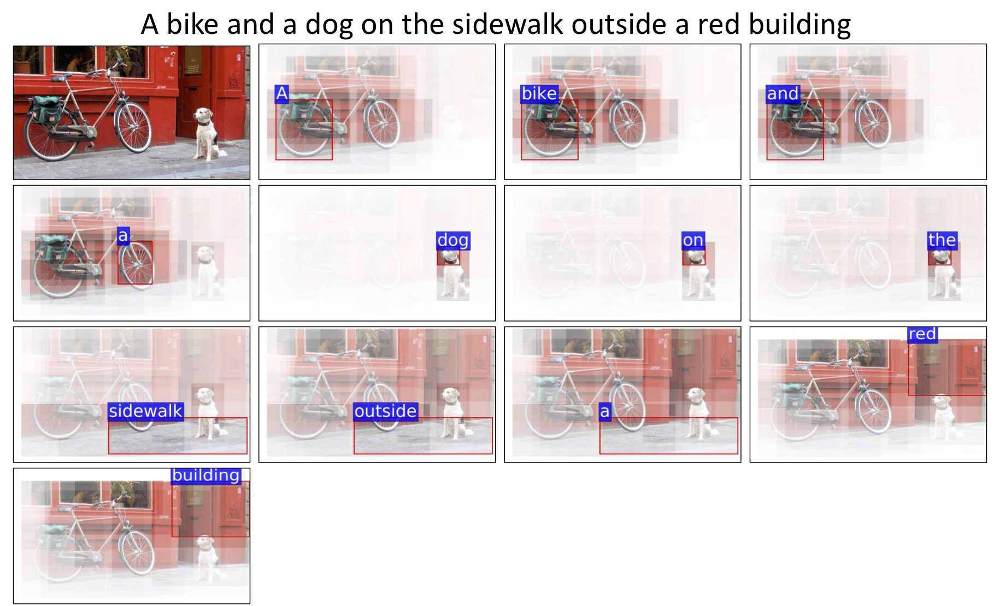
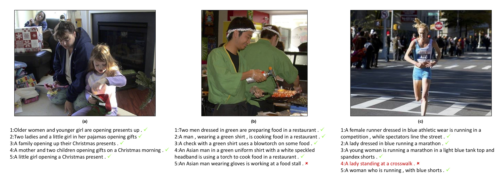
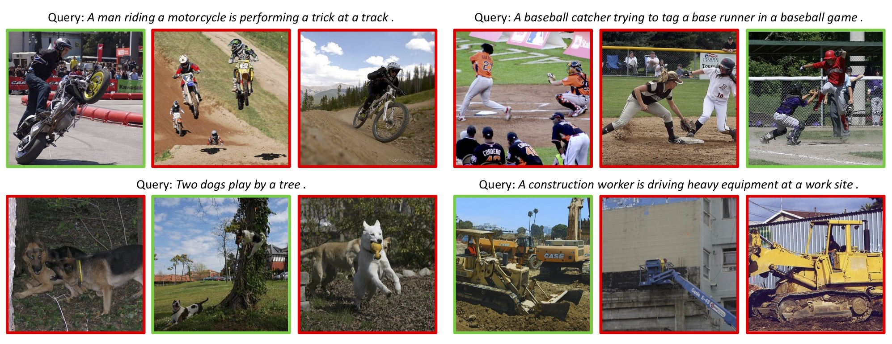
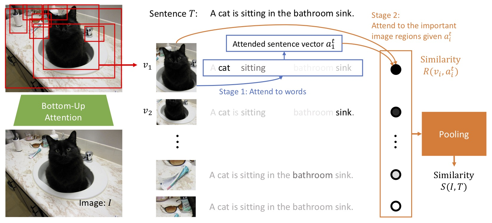
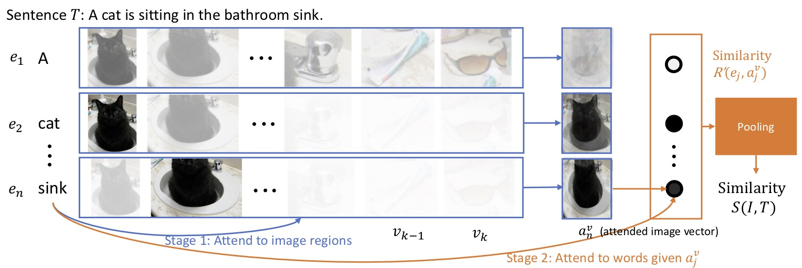

[Kuang-Huei Lee](https://scholar.google.com/citations?user=rE7-N30AAAAJ&hl)<sup>1</sup>, [Xi Chen](https://sites.google.com/site/xichenstephen/)<sup>1</sup>, [Gang Hua](https://www.microsoft.com/en-us/research/people/ganghua/)<sup>1</sup>, Houdong Hu<sup>1</sup>, [Xiaodong He](https://scholar.google.com/citations?user=W5WbqgoAAAAJ)<sup>2</sup>\*<br>
<sup>1</sup> Microsoft AI and Research, <sup>2</sup> JD AI Research
(* Work performed while working at Microsoft)

### [[ Paper ]](https://arxiv.org/abs/1803.08024) [ Code ]

This is the project page of Stacked Cross Attention Network (SCAN). Stacked Cross Attention is an attention mechanism for image-text cross-modal matching by inferring the latent language-vision alignments. This project is from Microsoft AI & Research. 

### Abstract

In this paper, we study the problem of image-text matching. Inferring the latent semantic alignment between objects or other salient stuffs (e.g. snow, sky, lawn) and the corresponding words in sentences allows to capture fine-grained interplay between vision and language, and makes image-text matching more interpretable. Prior works either simply aggregate the similarity of all possible pairs of regions and words without attending differentially to more and less important words or regions, or use a multi-step attentional process to capture limited number of semantic alignments which is less interpretable. In this paper, we present Stacked Cross Attention to discover the full latent alignments using both image regions and words in sentence as context and infer the image-text similarity. Our approach achieves the state-of-the-art results on the MS-COCO and Flickr30K datasets. On Flickr30K, our approach outperforms the current best methods by 22.1% in text retrieval from image query, and 18.2% in image retrieval with text query (based on Recall@1). On MS-COCO, our approach improves sentence retrieval by 17.8% and image retrieval by 16.6% (based on Recall@1 using the 5K test set).


### Infer the latent alignments between language and vision
An example of image-text matching showing attended image regions with respect to each word in the sentence. The brightness represents the attention strength, which considers the importance of both regions and words estimated by our model. This example shows that our model can infer the alignments between words and the corresponding objects/stuffs/attributes in the image (“bike” and “dog” are objects; “sidewalk” and “building” are stuffs; “red” is an attribute.)<br>
<br>

### Cross-modal retrieval

Text retrieval for given image queries<br>
<br>

Image retrieval for given text queries<br>
<br>

### Approach

Image-Text Stacked Cross Attention<br>
<br>

Text-Image Stacked Cross Attention<br>
<br>

### Code
Source code will be made available.

# Citation

```
@article{lee2018stacked,
  title={Stacked Cross Attention for Image-Text Matching},
  author={Lee, Kuang-Huei and Chen, Xi and Hua, Gang and Hu, Houdong and He, Xiaodong},
  journal={arXiv preprint arXiv:1803.08024},
  year={2018}
}
```

# Acknowledgments

The authors would like to thank [Po-Sen Huang](https://posenhuang.github.io/) and Yokesh Kumar for helping the manuscript.
